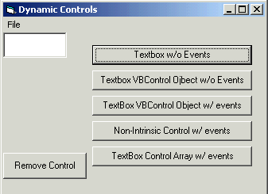



## aDynamicControls

### Description

The Purpose of this Example is to Understand the Various ways to Dynamically Add Controls into your Project. With each of the new controls, it may or may not have events due to how it is set up. The Example will use WithEvents, Class Event(subclassing),and VBControlExtender.

If you like the coding, Please Vote! The more vote, the more coding I can write. Thank You
 
### More Info
 
Be Sure to Read everything in the Project and Step-thru the code to understand what is happening.

Returns your new Control on the Form.

             |
---                |---
**Submitted On**   |2001-07-17 08:22:02
**By**             |[Jeremy Beal](https://github.com/Planet-Source-Code/PSCIndex/blob/master/ByAuthor/jeremy-beal.md)
**Level**          |Advanced
**User Rating**    |4.7 (70 globes from 15 users)
**Compatibility**  |VB 5\.0, VB 6\.0
**Category**       |[Miscellaneous](https://github.com/Planet-Source-Code/PSCIndex/blob/master/ByCategory/miscellaneous__1-1.md)
**World**          |[Visual Basic](https://github.com/Planet-Source-Code/PSCIndex/blob/master/ByWorld/visual-basic.md)
**Archive File**   |[aDynamicCo229457172001\.zip](https://github.com/Planet-Source-Code/jeremy-beal-adynamiccontrols__1-14020/archive/master.zip)

